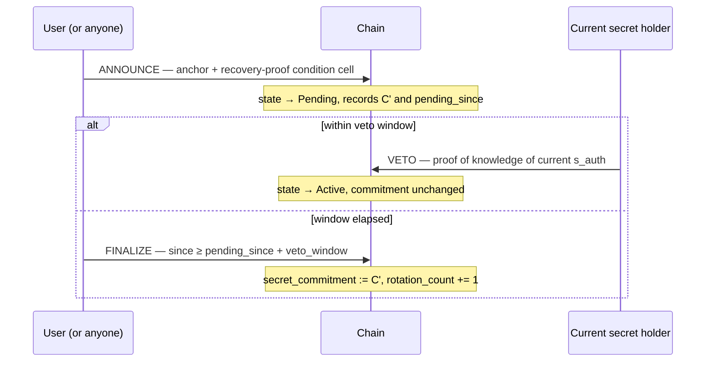

# SPEC — Identity Anchor

**Status:** design. No implementation. Not audited.
**Depends on:** [Structural Authorization](https://github.com/digitaldrreamer/ckb-structural-authorization) (SPEC-CORE), CKB `since`, an on-chain ZK verifier script.

---

## The problem this solves

In a prove-without-revealing auth system, a user's identity derives from a secret only they hold. That is the entire point — no custodian, no recovery service, nobody who can impersonate them.

It is also how these systems die. Lose the secret and you lose every account you ever made, with no path back, because recovery for a value nobody else holds has no obvious mechanism. This is a product-killing failure mode, not a cryptographic one, and it needs an answer before circuits get written.

The answer here: **the secret is a credential, not the identity.** Identity is anchored to a stable on-chain object; the secret proves control of that anchor and can be rotated when a Structural Authorization condition is satisfied at consensus.

---

## Design goals

1. **Rotatable.** Replacing the secret must not change who the user is to any relying party.
2. **No custodian.** Recovery must not require a service that learns the user's identity or can impersonate them.
3. **Revocable.** A compromised secret must be invalidatable, and relying parties must be able to tell.
4. **Consensus-arbitrated.** Whether a rotation is authorized is decided by a script, not a server.

### Non-goals

- Confidential on-chain state. See [Honest limits](#honest-limits).
- Recovering a secret. The protocol recovers *control*, never the lost value itself.
- Protecting a user whose recovery credential and vigilance are both lost.

---

## Key hierarchy

The critical design move is that the per-site identifier does **not** depend on the rotatable secret.

```
R           recovery root        (wallet key, or guardian-reconstructable seed)
 ├── s_link = KDF(R, "link")     stable, never rotated, never on-chain
 └── s_auth                      rotatable, commitment published on-chain

sub = H(s_link, domain)          per-site identifier — stable across rotation
```

If `sub` derived from `s_auth`, rotating would hand the user a brand-new identity at every site — a reset button, not a recovery. Deriving it from `s_link` means rotation replaces the authentication credential while every existing account survives.

`sub` never appears on-chain. It is revealed only to the relying party it belongs to, as a public input of the proof.

> **Do not derive `sub` from the anchor's Type ID.** Type IDs are public. Anyone could enumerate `H(anchor_id, domain)` over every anchor and every known domain, and link a user across all sites — defeating the property the product exists to provide.

---

## Build levels

The anchor is not needed on day one. Each level adds one capability and one cost.

| Level | Mechanism | Gains | Costs |
|---|---|---|---|
| **0** | No anchor. `s_link = KDF(wallet_key, "link")`, prove wallet control. | Recovery works — re-derive from the wallet. No cell, no capacity, no pool. | No revocation. Wallet compromise is total and permanent. Wallet loss is total. |
| **1** | Anchor cell holds `H(s_auth)`. Rotation authorized by proof of wallet control. | Revocation. A stolen `s_auth` can be invalidated without moving funds. | One cell per user. Capacity deposit. |
| **2** | Recovery policy admits k-of-n guardians or a prior-credential proof. | Survives wallet loss. | Policy complexity, guardian UX, larger circuits. |

**Ship Level 0 first.** It is a complete product, it needs no on-chain state at all, and it makes the Level 1 anchor an additive change rather than a prerequisite.

---

## The anchor cell

```
lock:  open lock — no key (structural authorization)
type:  identity-anchor
         args: type_id (32 bytes)
data:  AnchorData {
         version:            u8
         secret_commitment:  [u8; 32]   // H(s_auth)
         policy_commitment:  [u8; 32]   // H(recovery policy)
         rotation_count:     u32
       }
```

Steady-state data is 69 bytes. Pending-rotation state lives in a **separate short-lived cell** created at announce and destroyed at finalize, so the anchor does not carry ~50 bytes of dead capacity for its entire life.

**Capacity estimate:** 8 (capacity field) + 33 (open lock) + 65 (type script with Type ID args) + 69 (data) ≈ **175 CKB locked per anchor**. This is a deposit, not a fee — consuming the cell returns it.

---

## Rotation lifecycle

Three transactions. The veto window is what makes this safe; see [Threat model](#threat-model).



### ANNOUNCE

- **Inputs:** anchor cell (Active), condition cell of an authorized recovery-proof type.
- **Outputs:** anchor cell (unchanged data), pending cell recording `C'`, `pending_since`, `veto_window`.
- **Type script checks:** the condition cell's type is in the authorized set; the proof's public inputs bind to this anchor's `policy_commitment`, its current `rotation_count`, and to `C'`.

### VETO

- **Inputs:** anchor cell, pending cell, condition cell proving knowledge of the *current* `s_auth`.
- **Outputs:** anchor cell unchanged. Pending cell destroyed, capacity returned.

Whoever holds the current secret can always cancel a rotation they did not initiate.

### FINALIZE

- **Inputs:** anchor cell, pending cell with `since` ≥ `pending_since + veto_window`.
- **Outputs:** anchor cell with `secret_commitment := C'` and `rotation_count += 1`.

**Use block-number `since`, not timestamp.** Absolute timestamp `since` is validated against the median time of the previous 37 blocks ([RFC 0017](https://nervosnetwork.github.io/rfcs/rfcs/0017-tx-valid-since/0017-tx-valid-since.html)), so it drifts against wall clock. Block height is exact, which is what a security-critical window needs.

---

## Proof obligations

Every recovery proof must bind to all four, or it is replayable:

| Public input | Why |
|---|---|
| `policy_commitment` | Proves the policy being satisfied is the one the anchor committed to. |
| `rotation_count` | Makes each proof single-use. Without it, one captured proof rotates the anchor forever. |
| `C'` (new commitment) | Binds the proof to *this* rotation, not any rotation. |
| `anchor_type_id` | Binds the proof to this anchor, not another user's. |

---

## How relying parties check revocation

A relying party must confirm the presented proof was made with the anchor's *current* secret. Two modes, and the choice is a real trade-off:

**Accumulator mode (correct).** The proof asserts membership in the set of active anchors — "there exists an anchor whose `secret_commitment` matches my `s_auth`" — verified against a published Merkle root. The relying party learns nothing about *which* anchor. Preserves unlinkability. Requires maintaining and publishing the accumulator, and produces larger proofs.

**Direct mode (simple).** The proof reveals `anchor_type_id`. The relying party reads the cell directly. One RPC call, trivial to implement — **and it makes users linkable across every site**, which is the property the product exists to sell.

Direct mode is acceptable for a testnet demo. It is not acceptable in anything presented as privacy-preserving. Treat the accumulator as the main implementation cost of this design, and see [Open questions](#open-questions).

---

## Threat model

| Threat | Outcome | Mitigation |
|---|---|---|
| `s_auth` stolen | Attacker authenticates as the user until noticed. Cannot rotate — that needs a recovery proof. | User rotates. Old commitment stops validating. |
| Recovery credential stolen | Attacker announces a rotation and takes over. | Veto window. **This is the primary defense and the reason the window exists.** |
| Recovery credential stolen *and* user not watching | Full, permanent takeover. | None. Honest limit — the window only helps someone who is looking. |
| Recovery proof replayed | Repeated rotation by a captured proof. | Bind `rotation_count` into public inputs. |
| Third party grinds commitments | Recovers `s_auth` from `H(s_auth)`. | Full-strength hash and ≥128 bits of entropy in `s_auth`. Not a placeholder hash. |
| Third party spams ANNOUNCE | Anchor stuck in perpetual pending; user must keep vetoing. | Require the announcer to bond capacity, forfeited on veto. Open question — see below. |
| Third party consumes anchor capacity | Anchor bricked. | Type script must enforce capacity conservation and reject any output that is not a well-formed anchor. |

The spam row deserves attention. Structural Authorization means *anyone* can construct a valid transaction — that is the feature for a treasury, and a liability for identity. An attacker who cannot produce a recovery proof still cannot rotate, but the announce path may be cheap enough to grief with.

---

## Costs

**Cycles.** CKB mainnet `max_block_cycles` is 3,500,000,000, and there is **no per-transaction or per-script limit** — a single script may consume any amount so long as the block fits ([docs](https://docs.nervos.org/docs/script/vm-cycle-limits)). Measured verifiers on CKB-VM:

| Verifier | Cycles | Share of a block |
|---|---|---|
| SP1 / Plonk, optimized with `ckb-alt-bn128` | 63M | ~1.8% |
| Groth16 / BN256 (`ckb-zkp`) | 195.5M | ~5.6% |

Sources: [Optimized SP1 verifier for ckb-vm](https://talk.nervos.org/t/optimized-sp1-verifier-for-ckb-vm/10144) (April 2026), [sec-bit/ckb-zkp](https://github.com/sec-bit/ckb-zkp).

`ckb-zkp` is **inactive since December 2020 and marked "DO NOT USE IT IN PRODUCTION."** Cite it as evidence of feasibility, not as a dependency. Neither verifier covers Noir/UltraHonk — porting a Honk verifier to CKB-VM is unbuilt work. The cycle budget clearly accommodates it; that was the open question, and it is closed.

**Capacity.** ~175 CKB per anchor, returned when the cell is consumed. Only users who opt into Level 1+ pay it. Logins create no cells and cost nothing.

**Who funds it.** Not the donation-pool pattern from [ckb-transaction-firewall](https://github.com/digitaldrreamer/ckb-transaction-firewall). That treasury works because a governance registry grows slowly and boundedly; anchors grow at signup rate. A donation-funded pool scaling with user growth depletes — a failure the treasury docs already name. Anchors are user- or relying-party-funded deposits. The pool pattern still fits the revocation registry, which is small and slow.

---

## Honest limits

- **A CKB script cannot hold a secret.** Cell data and script args are public; anything a script reads, everyone reads. The chain holds a *commitment* and arbitrates which commitment is current. The secret never leaves the client. There is no configuration of this design in which "the contract is the secret."
- **Rotation history is public.** Nobody learns who a user is, but anchors are visible and rotations are timestamped. Activity and timing leak.
- **Direct mode is linkable.** Unlinkability requires the accumulator. Do not ship direct mode and describe it as private.
- **Level 0 recovery is only as strong as the wallet.** If the wallet is lost, so is everything. Level 2 exists for that, and is strictly more work.
- **The veto window protects the vigilant.** A user who never checks can be taken over by a stolen recovery credential.
- **Nothing here is implemented or audited.**

---

## Open questions

1. **Accumulator maintenance.** Who publishes the Merkle root of active anchors, how often, and what does a relying party do about staleness between updates? An anchor rotated after the last root publication still validates against the old root for a window.
2. **Announce-spam bonding.** How much capacity must an announcer bond, and where does it go on veto? Too low and griefing is cheap; too high and legitimate recovery is gated on funds the user may not have.
3. **`s_link` derivation across wallet types.** `KDF(R, "link")` needs a deterministic signature. Ed25519 and secp256k1 differ, and some wallets will not expose a stable deterministic signing primitive. Which wallets can actually support this?
4. **Guardian UX at Level 2.** k-of-n recovery requires guardians who are reachable years later. This is a social problem wearing a cryptographic costume, and it is where comparable systems have historically failed.
5. **Veto window length.** Long enough that a user notices, short enough that legitimate recovery is not painful. Probably user-configurable at anchor creation, with a protocol-enforced minimum.
